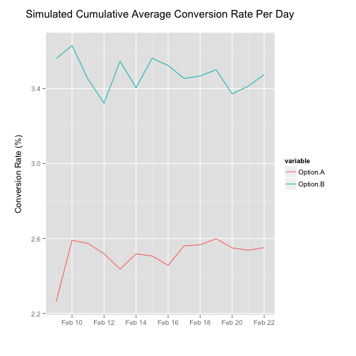

Experiment Planner
========================================================
author: Dave Ingram
date: February 22nd, 2015
transition: rotate
font-family: "Lucida Sans Unicode", "Lucida Grande", sans-serif

Rationalle
========================================================

Designing a proper experiment has a number of challenges, and 
online experiments (often called A/B Tests) are frequently
run by practioners without a strong statistical background.

**Experiment Planner** is an application which helps these
practioners to understand the randomness of their data through
simulation and statistical power calculations

Simulation
========================================================

The starting point of the application is an experiment simulator. It contains
a variety of controls to tweak the settings and then simulates an experiment
using a Poisson distribution for counts and successes. 

***

 

Statistical Power
========================================================

Calculating Statistical Power is an essential step in planning good experiments.
The second tab in this application allows you to tweak the settings of alpha
and beta parameters and determine the minimum number of trials that will be 
necessary in order to reach a particular statistical power.

Summary
========================================================

The advantages of using this application include:

- Increased understanding of Inferential Statistics
- Quick calculator for Statistical Power

Please enjoy!
