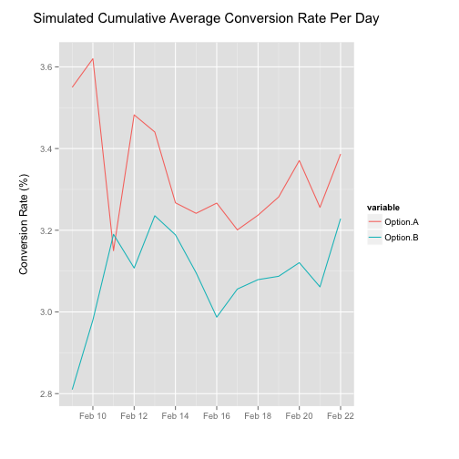

Experiment Planner
========================================================
author: Dave Ingram
date: February 22nd, 2015

Rationalle
========================================================

Designing a proper experiment has a number of challenges, and 
online experiments (often called A/B Tests) are frequently
run by practioners without a strong statistical background.

**Experiment Planner** is an application which helps these
practioners to understand the randomness of their data through
simulation and statistical power calculations

Simulation
========================================================

 

Slide With Plot
========================================================

 
